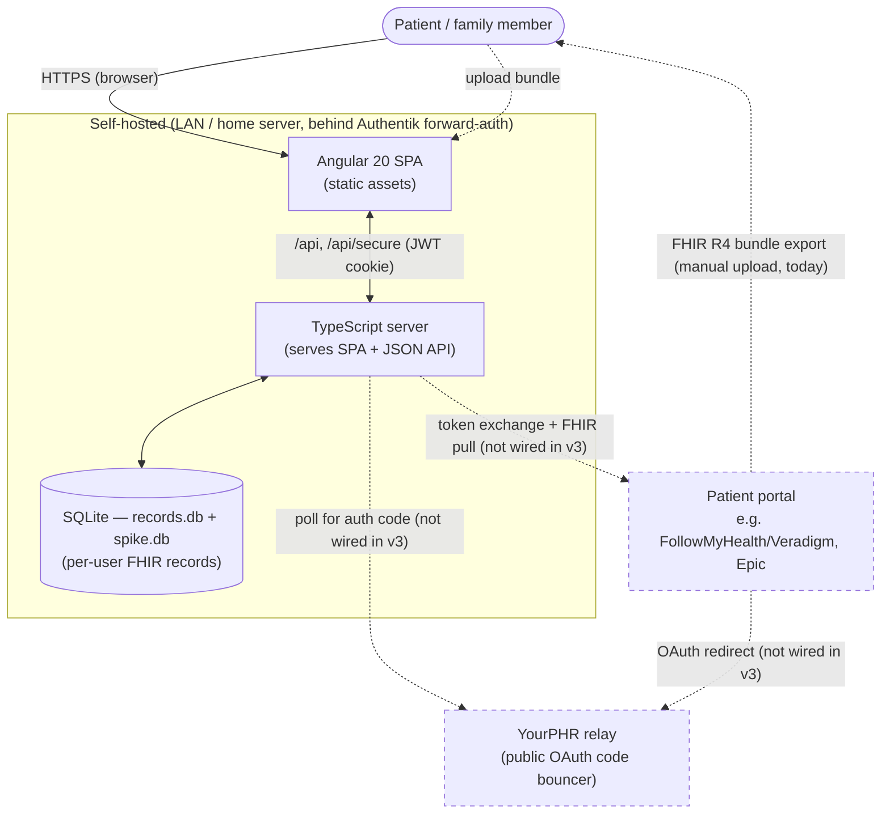
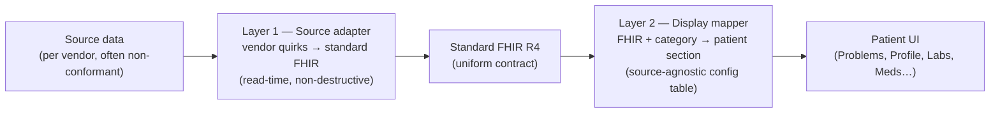
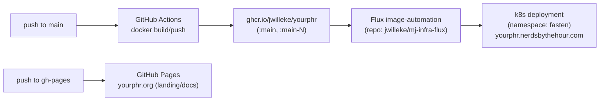

# YourPHR — Architecture

The single, leading map of how YourPHR fits together. Start here, then follow the links into the deep-dive docs. The detailed designs live in their own files (display, security, SMART relay, conformance); this page is the index and the high-level picture, not a duplicate of them.

> __Mission: Your medical records, immediately and in your hands — for free.__ (Fulfilling the [21st Century Cures Act](https://www.healthit.gov/topic/oncs-cures-act-final-rule), 2016.) Every architectural choice is judged against one question: *does it advance immediate, complete patient access to records?*

## What YourPHR is

A __self-hosted personal/family Personal Health Record (PHR) viewer__ — a standalone, community-maintained continuation of [Fasten OnPrem](https://github.com/fastenhealth/fasten-onprem) (GPL v3, attribution retained; see [`../README.md`](../README.md)). A __TypeScript backend__ (`src/`, Node 24, SQLite) serves a JSON API and the compiled __Angular 20__ single-page app, both built from this repository into one image. It imports __FHIR R4__ bundles — today by manual upload; live provider sync through the relay is a roadmap item (see [Roadmap](./Roadmap.md)).

> __The Go backend is gone.__ It served the product to v2.10.3 and was deleted on 2026-08-27 ([#677](https://github.com/jwilleke/yourphr/issues/677)); its history lives in the `v1.0.0`…`v2.10.3` tags. The only Go left is the OAuth relay. The rules the current stack is built on are in [`architecture-principles-typescript.md`](https://github.com/jwilleke/ngdpbase/blob/master/docs/planning/architecture-principles-typescript.md) (in ngdpbase) — read that before changing any of it.

It is a __display-only client__, not an EHR and not a FHIR server: it requests/imports records and presents them legibly. That framing drives the conformance posture (see [US Core support](./us-core/README.md)).

> __Identifier note:__ the product is __YourPHR__, but the Go module path stays `github.com/fastenhealth/fasten-onprem`, and upstream-tied technical names (`fasten-sources`, `FastenDisplayModel`, the k8s `fasten` namespace) are kept on purpose. Only user-facing strings are "YourPHR". See EPIC [#2](https://github.com/jwilleke/yourphr/issues/2) and [`../AGENTS.md`](../AGENTS.md).

## System context



Dashed paths are __not functional in v3__: the relay is deployed but the server does not use it, and `GET /api/secure/source/relay-config` reports that none is configured rather than pretending otherwise. Manual bundle upload is the supported import path. Proving one production provider end to end is [#408](https://github.com/jwilleke/yourphr/issues/408). See the [SMART on FHIR plan](./planning/smart-on-fhir/smart-on-fhir.md).

## Component map

| Layer | Tech / location | Notes |
|---|---|---|
| __Frontend__ | Angular 20 SPA — `frontend/src/app/` | Upgraded 14→20 (epic [#12](https://github.com/jwilleke/yourphr/issues/12)). Served as static assets by the server, from the same image and the same commit ([#652](https://github.com/jwilleke/yourphr/issues/652)). JWT in an HttpOnly cookie ([#103](https://github.com/jwilleke/yourphr/issues/103)). |
| __Entry point__ | [`../src/main.ts`](../src/main.ts) → `src/cli/` | A subcommand layer ([#654](https://github.com/jwilleke/yourphr/issues/654)): `start` (the default), `migrate`, `reset-password`, `version`, `help`. An unrecognised command exits non-zero and never starts a server. |
| __Composition root__ | [`../src/app.ts`](../src/app.ts) | `openStores()` / `assembleApp()` build the engine, its managers in dependency order, and the providers configuration selects. |
| __Web / API__ | [`../src/server.ts`](../src/server.ts) | Plain `node:http` — __no TLS__; a reverse proxy terminates it. `/api` public, `/api/secure` behind the session cookie, `/api/secure/admin` behind `admin-read`. SSE at `/api/secure/events/stream`. |
| __Managers__ | `src/framework/managers/`, `src/app/managers/` | __A resource has exactly one door.__ Configuration, users, sessions, audit, backups, jobs, settings, database; records, sources, catalog, glossary, demo. |
| __Providers__ | `src/framework/providers/`, `src/app/providers/` | The only code that touches a store or the network, chosen by configuration with an inert `null` alternative. `npm run check:store` and `npm run check:boundary` fail CI if either boundary is crossed. |
| __Request context__ | [`../src/framework/ApiContext.ts`](../src/framework/ApiContext.ts) | Who is asking, on every manager call. Permissions are `{target}-{action}`; roles are data. |
| __Data access__ | `SqliteRecordsProvider` over `records.db`; the app database is `spike.db` | Both compose their paths from the storage root in configuration ([#626](https://github.com/jwilleke/yourphr/issues/626)). At-rest encryption is off unless a key is set, and the server says so on every start. |
| __FHIR handling__ | `@medplum/fhirtypes`, `fhirpath` | No code generation. The Go generators (`go generate`, `tygo`) went with the Go stack. |
| __Migration from Go__ | [`../src/migrate/`](../src/migrate/) | One-way and idempotent; its exit criterion is a record-for-record verification, not a successful import. |
| __Relay__ | [`../relay/`](../relay/) | The only Go left: a pure-stdlib, dependency-free store-and-poll OAuth `code` bouncer. Never sees tokens. EPIC [#20](https://github.com/jwilleke/yourphr/issues/20). |

## Key flows

### Import & display (the supported path today)

```mermaid
sequenceDiagram
    actor P as Patient
    participant SPA as Angular SPA
    participant API as TypeScript server
    participant DB as SQLite
    P->>SPA: Upload FHIR R4 bundle
    SPA->>API: POST bundle (/api/secure)
    API->>API: Parse resources; FHIRPath extraction → indexed columns + FTS5 text
    API->>DB: Store raw FHIR + search params (scoped to UserID)
    Note over API,DB: Raw FHIR is stored verbatim — never mutated
    P->>SPA: Open dashboard / record
    SPA->>API: GET /api/secure/... (JWT cookie)
    API->>DB: Query (per-user)
    API->>API: Layer 1 reconcile (read-time) → Layer 2 display mapping
    API-->>SPA: Patient-legible view models
```

### Live provider sync (roadmap — relay store-and-poll)

```mermaid
sequenceDiagram
    actor P as Patient
    participant SPA as Angular SPA
    participant Prov as Provider (SMART/FHIR)
    participant Relay as Public relay
    participant API as Local YourPHR
    P->>Prov: Authorize (browser, BYO client_id)
    Prov->>Relay: redirect /callback?code&state
    Relay->>Relay: store {state: code}, ~60s TTL
    API->>Relay: poll /pending?state (X-Yourphr-Token secret)
    Relay-->>API: code (then deletes it)
    API->>Prov: exchange code → tokens (local, direct)
    API->>Prov: pull FHIR ($everything)
    Note over Relay: never sees tokens; provider-agnostic
```

Why a relay at all: a LAN/NAT instance has no public `redirect_uri`, but providers require one. The relay is the only public piece; the instance stays outbound-only. Deep dive: [`oauth-gateway.md`](./planning/smart-on-fhir/oauth-gateway.md).

## The display architecture

This is the heart of YourPHR's value — turning messy, vendor-specific FHIR into something a patient can actually read. __Two independent layers meet at one contract: standard FHIR R4.__



- __Layer 1 (per-vendor)__ is the *only* place vendor-specific logic lives. It runs as a __non-destructive read-time reconcile view-model__ — raw FHIR is never mutated. Its central job is synthesizing the standard fields the source omitted (most importantly `Condition.category`) and resolving provenance/reference quirks.
- __Layer 2 (source-agnostic)__ keys only off standard FHIR. Add a conformant source (Epic, Cerner) and it flows through with __zero new display code__.

Governing principles: __patient-legible__ ([#262](https://github.com/jwilleke/yourphr/issues/262) — meaning first, translate codes, plain language), __no-guessing__ (display only from explicit record signals; absent → "unknown", never inferred), and __no dedup__ (report facts as the source gave them).

__Deep dives:__

- [Classification & display architecture](./your-phr-dashboard/classification-and-display-architecture.md) — the two-layer model in full, condition-classifier decision table, provenance resolver, FollowMyHealth reference quirks.
- [Patient-legible display principle](./your-phr-dashboard/patient-legible-display.md) — the north star (#262).
- [The dashboard](./your-phr-dashboard/README.md) — the config-driven home view. Note the Go handler it describes is gone; the v3 dashboard endpoint is one of the gaps in [#680](https://github.com/jwilleke/yourphr/issues/680).
- [Phase 1 condition-classifier spec](./your-phr-dashboard/phase-1-condition-classifier-spec.md) · [Per-profile dashboards](./your-phr-dashboard/per-profile-dashboards-brainstorm.md)

## Code generation (don't hand-edit generated files)

__There is no code generation.__ Both generators went with the Go stack ([#677](https://github.com/jwilleke/yourphr/issues/677)):

- `go generate` produced ~70 `fhir_*.go` models from `search-parameters.json`. The TypeScript stack
  uses `@medplum/fhirtypes` and evaluates FHIRPath directly, so nothing is generated.
- `tygo` produced `frontend/src/app/models/patient-access-brands/*.ts` from Go structs. Those files
  are committed and still imported; they are now ordinary hand-maintained TypeScript with no
  upstream.

Nothing in the tree needs regenerating before a commit.

## Deployment & delivery



- __Running app:__ `yourphr.nerdsbythehour.com` (internal/LAN, behind Authentik forward-auth). GitOps via __Flux__ in [`jwilleke/mj-infra-flux`](https://github.com/jwilleke/mj-infra-flux) (`apps/production/fasten/`). The k8s app/namespace are still named `fasten`.
- __Project site:__ [`yourphr.org`](https://yourphr.org) — GitHub Pages from the `gh-pages` branch (not the app).
- __Self-host:__ Docker / `docker compose`; generates its own TLS CA at runtime. See [`../README.md`](../README.md).

## Security posture

Solid foundation for a self-hosted/family threat model behind forward-auth; __not yet hardened for direct public exposure.__ The dominant residual risk is the __default HS256 JWT signing key with no forced rotation__ ([#102](https://github.com/jwilleke/yourphr/issues/102)) — all per-user isolation trusts that signature.

Strengths worth knowing: per-user scoping enforced from the request context, an admin gate that reads the role rather than trusting a claim, a dedicated [SSRF guard](../src/http/ssrf.ts) that CI proves cannot be walked around, an access log where an unloggable read fails rather than completing silently ([#614](https://github.com/jwilleke/yourphr/issues/614)), and a relay that never sees tokens.

__Full assessment + prioritized backlog:__ [Architecture & security review](./planning/architecture-security-review.md). Standards mapping: [Standards conformance](./planning/Standards-Conformance.md).

## Known architectural tensions (read before large changes)

1. __Multi-user sharing is half-built.__ The README describes admin/viewer roles and cross-user grants; the data layer scopes strictly to the current user with no real ACL. Designing the authorization layer __before__ building sharing ([#256](https://github.com/jwilleke/yourphr/issues/256)) is far cheaper than retrofitting.
2. __SQLite is a known ceiling__ for a lifetime, multi-family PHR (single-writer). Postgres is the documented escape hatch but is currently broken.
3. __Default JWT key__ ([#102](https://github.com/jwilleke/yourphr/issues/102)) — see Security posture above; gating item before broader exposure.

## Where to read next — doc index

| Topic | Doc |
|---|---|
| __Roadmap & phasing__ | [`Roadmap.md`](./Roadmap.md) |
| __Repo guide / conventions / commands__ | [`../AGENTS.md`](../AGENTS.md) · [`../README.md`](../README.md) |
| __Display: classification & two-layer model__ | [`your-phr-dashboard/classification-and-display-architecture.md`](./your-phr-dashboard/classification-and-display-architecture.md) |
| __Display: patient-legible north star__ | [`your-phr-dashboard/patient-legible-display.md`](./your-phr-dashboard/patient-legible-display.md) |
| __Dashboard design__ | [`your-phr-dashboard/README.md`](./your-phr-dashboard/README.md) |
| __Security & architecture review__ | [`planning/architecture-security-review.md`](./planning/architecture-security-review.md) |
| __Standards conformance__ | [`planning/Standards-Conformance.md`](./planning/Standards-Conformance.md) · [CSP](./planning/enforcing-CSP-issue.md) |
| __US Core support & coverage__ | [`us-core/README.md`](./us-core/README.md) · [`us-core/conformance-coverage.md`](./us-core/conformance-coverage.md) |
| __SMART on FHIR / live sync__ | [`planning/smart-on-fhir/smart-on-fhir.md`](./planning/smart-on-fhir/smart-on-fhir.md) · [`planning/smart-on-fhir/oauth-gateway.md`](./planning/smart-on-fhir/oauth-gateway.md) · [relay README](../relay/README.md) |
| __Vendor specifics (FollowMyHealth/Veradigm/Epic)__ | [`vendors/README.md`](./vendors/README.md) |
| __FHIR handling notes__ | [`FHIR/fhir-testing.md`](./FHIR/fhir-testing.md) · [`FHIR/fhir-converter-local.md`](./FHIR/fhir-converter-local.md) · [`FHIR/fractional-quantity-values.md`](./FHIR/fractional-quantity-values.md) · [`FHIR/uncoded-questionnaires.md`](./FHIR/uncoded-questionnaires.md) |
| __Health-record ecosystem background__ | [`planning/personal-health/health-record-aggregation.md`](./planning/personal-health/health-record-aggregation.md) · [`planning/personal-health/fastenhealth-ecosystem.md`](./planning/personal-health/fastenhealth-ecosystem.md) |

---

*This is a living document. When a component, flow, or deployment path changes materially, update the diagram and the relevant deep-dive doc — and keep this page as the index, not a second copy of the detail.*
