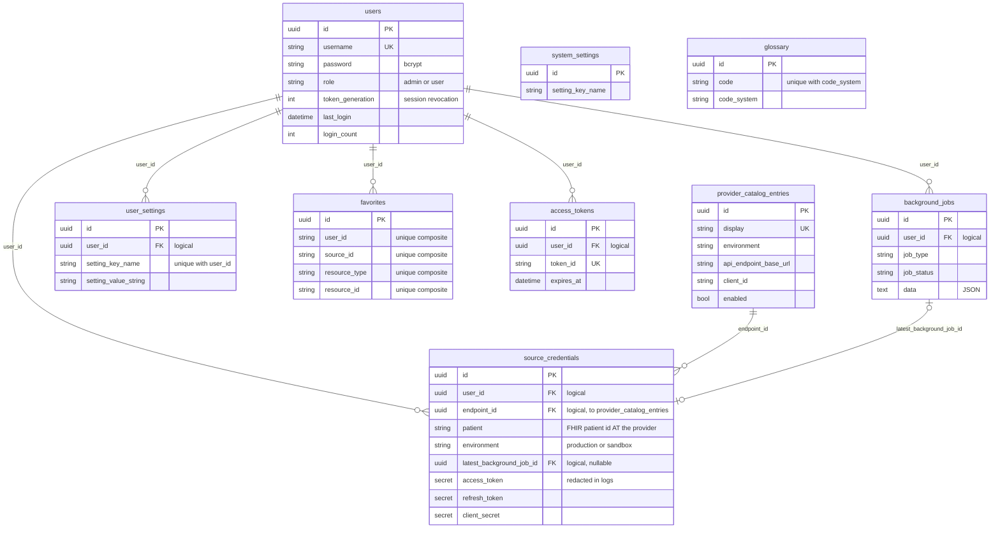
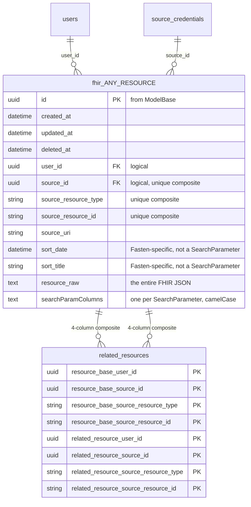
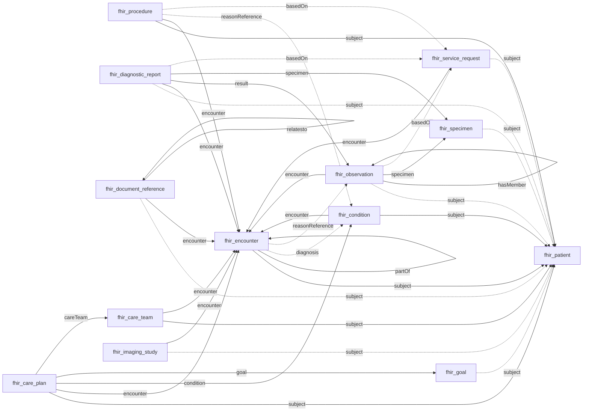
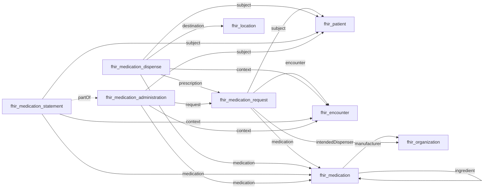
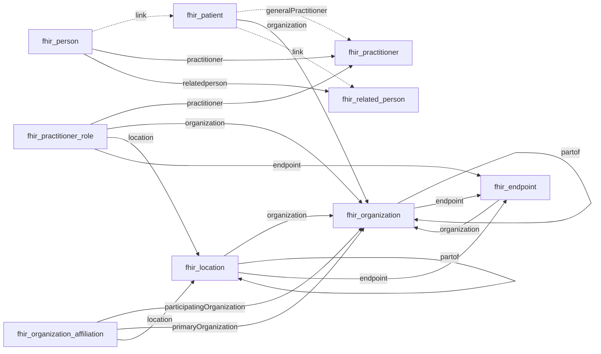
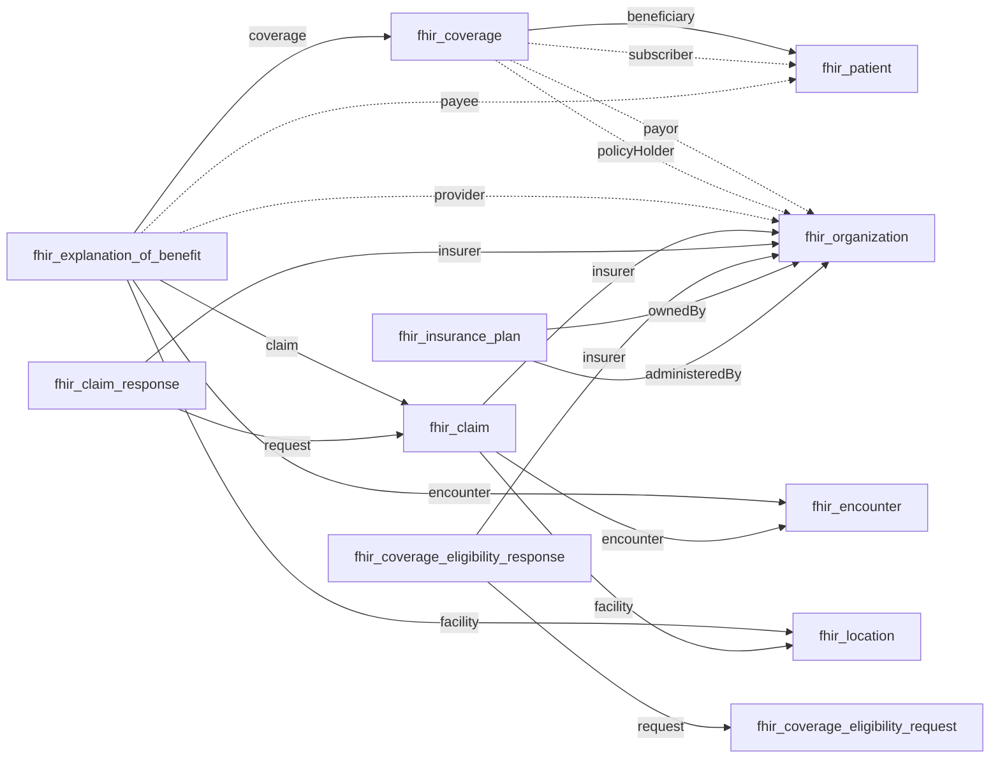
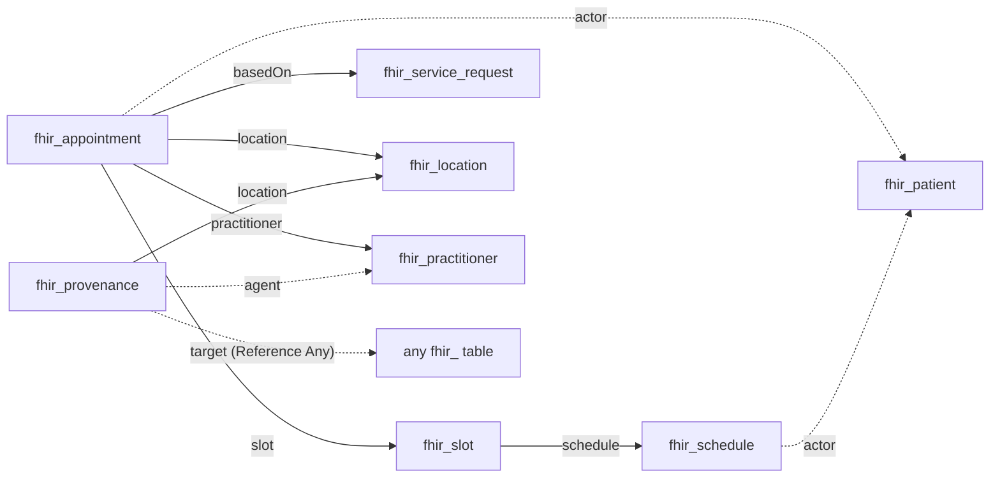

# Database ERD (logical)

The SQLite schema has __no foreign key constraints__ — `gorm.Config.DisableForeignKeyConstraintWhenMigrating`
is `true` in both `sqlite_repository.go` and `postgres_repository.go`, so `AutoMigrate` emits no
`REFERENCES` clauses. (The `_foreign_keys=on` DSN pragma only asks SQLite to *enforce* constraints;
none are ever created, so it is a no-op.)

This document draws the relations that __exist logically__ but are not declared to the database. Every
edge below is derived from source in this repo, not from general FHIR knowledge:

- __Application tables__ — from the hand-written models in `backend/pkg/models/*.go` and the
  `AutoMigrate` calls in `backend/pkg/database/gorm_repository_migrations.go`.
- __FHIR resource tables__ — from `backend/pkg/models/database/fhir_*.go`, generated by
  `generate.go` from `search-parameters.json`.
- __FHIR reference edges__ — from the `target` array of each `reference`-type SearchParameter in
  `search-parameters.json`. The generator reads `Base`, `Type` and `Expression` but __drops
  `Target`__, which is exactly the information a foreign key would have carried.

## Layer 1 — application tables

These are hand-written models with ordinary scalar keys. The relations here are the ones that
genuinely could be foreign keys today.



Notes on this layer:

- `source_credentials.endpoint_id -> provider_catalog_entries.id` is not just inferred from the
  name; migration `20260619000000` joins on it directly:
  `UPDATE source_credentials SET environment = ? WHERE endpoint_id IN (SELECT id FROM provider_catalog_entries WHERE environment = ?)`.
- `favorites` and `access_tokens` store `user_id`/`source_id` as __strings__, not `uuid`, so they
  could not take a FK without a type change.
- Legal consent is __not__ a table. It is a row in `user_settings` under the
  `LegalConsentSettingKey` name (see `gorm_repository_settings.go`).
- `system_settings` and `glossary` are instance-global — deliberately unrelated to `users`.
- `migrations` (gormigrate's bookkeeping table) is omitted.

## Layer 2 — how a FHIR resource is physically stored

All 56 generated `fhir_*` tables share an identical header from the embedded
`ResourceBase -> OriginBase -> ModelBase` chain, then add one column per FHIR SearchParameter.



The identity that matters is __not__ `id`. It is the composite
`(source_id, source_resource_type, source_resource_id)`, which carries the unique index from
`OriginBase` and is what `related_resources` joins on. `id` is a fresh UUID assigned per row by
`BeforeCreate` and is referenced by nothing.

`related_resources` is the one declared relation in the whole FHIR layer — a self-referential
many-to-many on `ResourceBase`, created by GORM from the `many2many:related_resources` tag. It
cannot take a foreign key even in principle: its target is `ResourceBase`, an embedded struct with
no table, so an edge may point into any of the 56 `fhir_*` tables and SQL has no way to express
"references one of these". That is why edges are written as a raw map insert into
`Table("related_resources")` and traversed in Go by `GetFlattenedResourceGraph`, which loads the
whole edge list and builds an in-memory directed graph.

Two naming quirks to expect when writing SQL by hand:

- Table names are __singular__ snake_case (`fhir_document_reference`, not `..._references`) because
  each model overrides `TableName()`.
- Column naming is __mixed__. Base columns are snake_case (`source_resource_id`, `sort_date`,
  `resource_raw`); SearchParameter columns are camelCase (`reasonReference`, `serviceProvider`,
  `metaLastUpdated`) because the generator applies `strcase.ToLowerCamel`.

## Layer 3 — the FHIR reference graph

Below are the relations a foreign key *would* have expressed, taken from the SearchParameter
`target` arrays. Read every edge as: __the source table has a camelCase JSON column named after the
edge label, holding reference strings that point at the target table's `source_resource_id`__.

Legend for all Layer 3 diagrams:

- A solid arrow is a reference column with a single possible target table.
- A dashed arrow is __polymorphic__ — the same column may point at several tables. This is a
  primary reason no FK is possible.
- Catch-all `Reference(Any)` columns (`Provenance.target`, `Composition.entry`,
  `Condition.evidenceDetail`, `Observation.focus`, `Consent.data`, `Appointment.supportingInfo`,
  `ClinicalImpression.supportingInfo`, `DocumentReference.related`, `QuestionnaireResponse.subject`,
  `DeviceRequest.basedOn`) are omitted; they may target all 56 tables.

### Clinical core

`Encounter` and `Patient` are the two hubs. Note that most clinical types reach the patient through
`subject`, and reach each other through `encounter`.



### Medications



### Actors and directory



### Insurance and claims

This is the Medicare / CMS Blue Button 2.0 cluster — `Patient`, `Coverage` and
`ExplanationOfBenefit` are the three resource types those SMART scopes grant.



`ExplanationOfBenefit` and `Claim` have __no patient column at all__ (see the next section). That
link is recovered at read time instead: `handler/insurance.go` passes each row's `resource_raw` to
the EOB and Coverage classifiers, which extract the stated `patient` / `beneficiary` reference, and
`backend/pkg/patientlink` resolves it against the imported `Patient` rows — associating a claim only
on an explicit reference that resolves, never by inference.

### Scheduling and provenance



## Where the patient link is missing entirely

`generate.go` skips the SearchParameter named `patient` outright:

```go
if entry.Resource.Name == "patient" {
    //skip Patient, not needed for searching.
    continue
}
```

For resources whose only subject-ish parameter is `patient` (rather than `subject`), the result is
that __no column links the row to a patient__. The link survives only inside `resource_raw` and in
`related_resources`.

Of the 56 generated tables, 29 have a patient-linking column (`subject`, `beneficiary`,
`participant` or `actor`) and 27 do not. Most of the 27 are not patient-scoped by nature
(`Organization`, `Practitioner`, `Location`, `Medication`, `Endpoint`, `Questionnaire`,
`InsurancePlan`, `OrganizationAffiliation`, `PractitionerRole`, `RelatedPerson`, `Device`,
`Person`, `Slot`, `Binary`, `Patient` itself). These are the ones where it is a real gap:

| Table | Patient link in FHIR | Column present |
| --- | --- | --- |
| `fhir_allergy_intolerance` | `AllergyIntolerance.patient` | none |
| `fhir_immunization` | `Immunization.patient` | none |
| `fhir_family_member_history` | `FamilyMemberHistory.patient` | none |
| `fhir_claim` | `Claim.patient` | none |
| `fhir_explanation_of_benefit` | `ExplanationOfBenefit.patient` | none |
| `fhir_vision_prescription` | `VisionPrescription.patient` | none |
| `fhir_nutrition_order` | `NutritionOrder.patient` | none |
| `fhir_claim_response` | `ClaimResponse.patient` | none |
| `fhir_coverage_eligibility_request` | `CoverageEligibilityRequest.patient` | none |
| `fhir_coverage_eligibility_response` | `CoverageEligibilityResponse.patient` | none |
| `fhir_enrollment_response` | via `EnrollmentRequest` | none |
| `fhir_provenance` | `Provenance.patient` | none |

Three of these have no `encounter` column either, so they carry no structural link to anything
clinical at all:

- `fhir_allergy_intolerance` — only `asserter` and `recorder` (both pointing at people, not the patient).
- `fhir_immunization` — only `location`, `manufacturer`, `performer`, `reaction`, `reasonReference`.
- `fhir_family_member_history` — only `instantiatesCanonical`.

For those rows, the sole machine-readable link back to a patient is the `related_resources` edge
built at import time from the raw bundle's references.

## Regenerating this document

The edges come from `backend/pkg/models/database/search-parameters.json`. To re-derive them, filter
that bundle to entries where `resource.type == "reference"` and `resource.base` intersects
`AllowedResources` in `generate.go`, then read `resource.target` for the possible target tables.
Treat any parameter with 20 or more targets as `Reference(Any)`.

If `search-parameters.json` or `AllowedResources` changes, re-run `make generate-backend` and update
this document alongside the regenerated `fhir_*.go` files.
